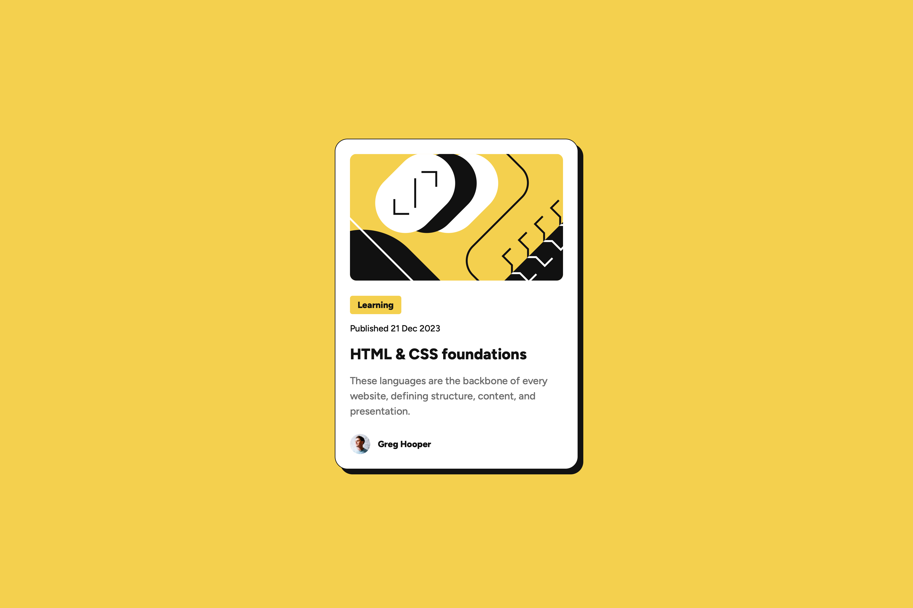
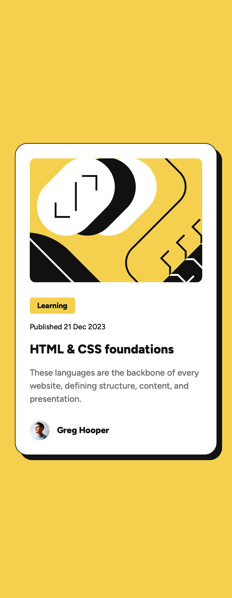

# Frontend Mentor - Blog preview card solution

This is a solution to the [Blog preview card challenge on Frontend Mentor](https://www.frontendmentor.io/challenges/blog-preview-card-ckPaj01IcS). Frontend Mentor challenges help you improve your coding skills by building realistic projects.

## Table of contents

- [Overview](#overview)
  - [The challenge](#the-challenge)
  - [Screenshot](#screenshot)
  - [Links](#links)
- [My process](#my-process)
  - [Built with](#built-with)
  - [What I learned](#what-i-learned)
  - [Continued development](#continued-development)
  - [Useful resources](#useful-resources)
  - [AI Collaboration](#ai-collaboration)
- [Author](#author)
- [Acknowledgments](#acknowledgments)

## Overview

### The challenge

Build out the blog preview card and get it looking as close to the design as possible.

Users should be able to:

- See hover and focus states for all interactive elements on the page

### Screenshot




### Links

- Solution URL: [Blog preview card source](https://github.com/QusBee/practice/tree/main/frontend-mentor/blog-preview)
- Live Site URL: [Blog preview card](https://qusbee.github.io/practice/frontend-mentor/blog-preview/)

## My process

### Built with

- Semantic HTML5 markup
- CSS custom properties
- Flexbox
- BEM class naming
- Self-hosted fonts with `@font-face`
- Desktop-first workflow with a media query for small screens

### What I learned

This project was mostly about matching a Figma design exactly, and a few details turned out to be less obvious than they looked.

**Self-hosting fonts with `@font-face`.** The font files were already in the project, so instead of linking to Google Fonts I described each weight myself (500 and 800). The `src` path is relative to the CSS file, while the optional `preload` link in the HTML uses a path relative to the HTML file, so the same font has two different paths:

```css
@font-face {
  font-family: 'Figtree';
  src: url('../assets/fonts/static/Figtree-Medium.ttf') format('truetype');
  font-weight: 500;
  font-display: swap;
  font-style: normal;
}
```

**Borders and `box-sizing`.** In Figma the card padding is measured from the outer edge and the stroke sits inside it. In CSS the border is added on top of the padding, so with `box-sizing: border-box` the image ended up 2px narrower and the card 2px taller than the design. Subtracting the border width from the padding on all four sides fixed both.

**`min-height: 100dvh` and margins.** Putting `margin` on the `body` made the page taller than the screen and always added a scrollbar. Using `padding` on the `body` keeps the spacing without the extra height, because `border-box` includes it in `min-height`.

**Do not edit assets to fix a layout problem.** At first I changed the height in the SVG file to get exactly 200px. It is cleaner to leave the original file and set the height in CSS with `object-fit: cover`.

**Links need an `href`.** An `<a>` without `href` is not focusable and is not announced as a link, so hover and focus states have nothing to work on. I also learned that the yellow hover colour has low contrast on white, so the focus outline matters.

**Small things.** Flex items in a column stretch to the full width, so the category label needed `width: fit-content`. An empty `alt` is right for decorative images such as the illustration and the avatar next to the author name.

### Continued development

- Choose breakpoints based on where the layout needs a change, not only on the design width (375px).
- Try `clamp()` for fluid font sizes instead of one fixed value per breakpoint.
- Keep practising how Figma values (strokes, padding, line height) map to CSS.
- Spend more time on accessibility, including colour contrast and testing with a screen reader.

### Useful resources

- [MDN - @font-face](https://developer.mozilla.org/en-US/docs/Web/CSS/@font-face) - Explained the descriptors and the `format()` values.
- [MDN - object-fit](https://developer.mozilla.org/en-US/docs/Web/CSS/object-fit) - How an image fills a fixed box without being distorted.
- [MDN - box-sizing](https://developer.mozilla.org/en-US/docs/Web/CSS/box-sizing) - Why padding and borders change the final size of an element.
- [MDN - rel="preload"](https://developer.mozilla.org/en-US/docs/Web/HTML/Attributes/rel/preload) - Preloading fonts and the `crossorigin` requirement.

### AI Collaboration

I used Claude as a mentor and reviewer, not as a code generator.

- **How I used it:** I wrote all the HTML and CSS myself. Claude reviewed each stage and pointed out problems such as typos in class names, a link without `href`, the border and padding mismatch with Figma, and the scrollbar caused by `body` margins. It explained concepts as options and let me decide. Once I also asked for a reference render of the finished card, only to compare it with my own result.
- **What worked well:** Deciding between options myself (Google Fonts or `@font-face`, `margin` or `padding` on the `body`, editing the SVG or using CSS) helped me understand the trade-offs.
- **What I'd do differently:** Measure values in Figma and DevTools before asking, so I can find the cause of a 2px difference myself.

## Author

- Frontend Mentor - [@QusBee](https://www.frontendmentor.io/profile/Qusbee)
- GitHub - [@QusBee](https://github.com/Qusbee)

## Acknowledgments

Thanks to the Frontend Mentor team for the design files and challenge brief.
