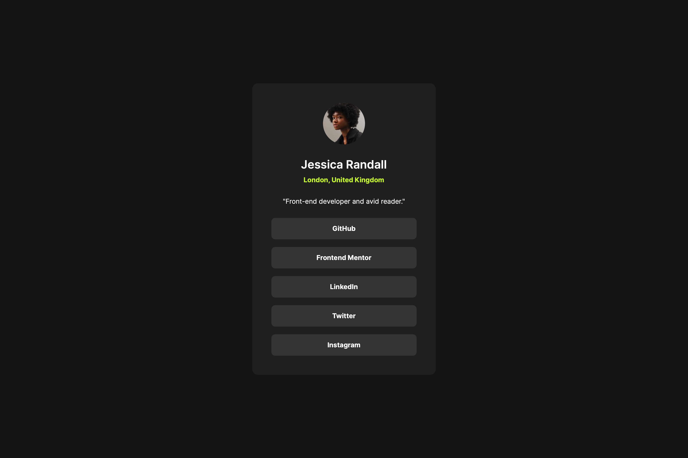
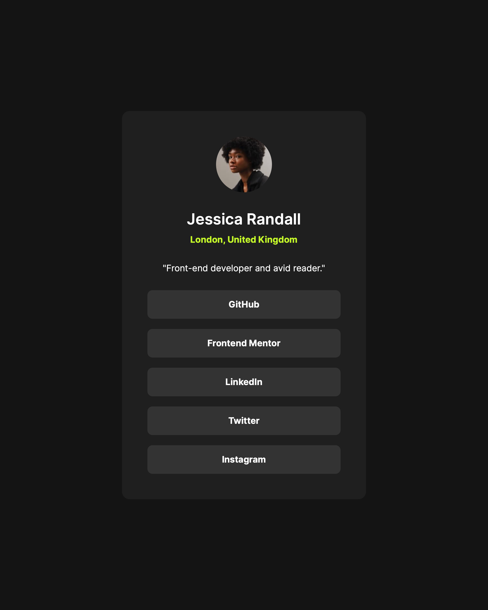
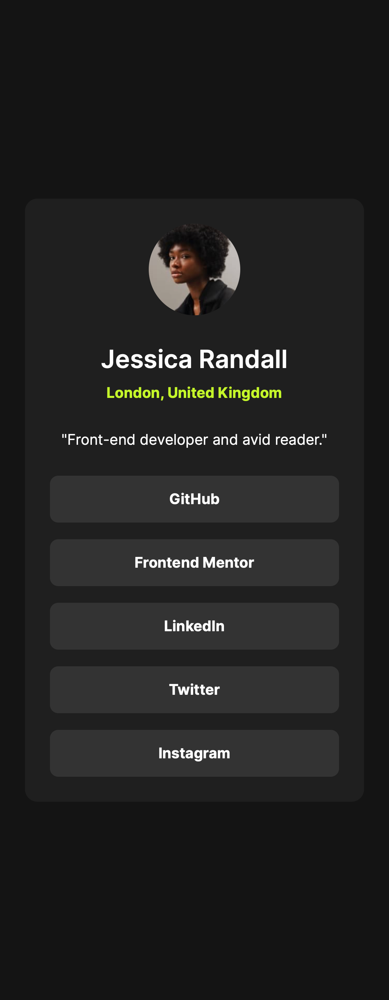

# Frontend Mentor - Social links profile solution

This is a solution to the [Social links profile challenge on Frontend Mentor](https://www.frontendmentor.io/challenges/social-links-profile-UG32l9m6dQ). Frontend Mentor challenges help you improve your coding skills by building realistic projects.

## Table of contents

- [Overview](#overview)
  - [The challenge](#the-challenge)
  - [Screenshot](#screenshot)
  - [Links](#links)
- [My process](#my-process)
  - [Built with](#built-with)
  - [What I learned](#what-i-learned)
  - [Continued development](#continued-development)
  - [Useful resources](#useful-resources)
  - [AI Collaboration](#ai-collaboration)
- [Author](#author)
- [Acknowledgments](#acknowledgments)

## Overview

### The challenge

Build out the social links profile card and get it looking as close to the design as possible.

Users should be able to:

- See hover and focus states for all interactive elements on the page

### Screenshot





### Links

- Solution URL: [Social links profile source](https://github.com/QusBee/practice/tree/main/frontend-mentor/links-profile)
- Live Site URL: [Social links profile](https://qusbee.github.io/practice/frontend-mentor/links-profile/)

## My process

### Built with

- Semantic HTML5 markup
- CSS custom properties
- Flexbox
- BEM class naming
- Self-hosted fonts with `@font-face`
- Mobile-first workflow

### What I learned

This was a small project, but a lot of the lessons came from questioning choices that looked fine at first.

**Semantics of a list of links.** The links are an `ul` of `a` elements, so a screen reader announces how many there are. In Safari with VoiceOver, `list-style: none` removes the list semantics, so I added `role="list"` to keep them. I also decided that a plain list is enough here and the `nav` wrapper was not needed, and I used a normal `<p>` for the bio because `<q>` renders its own curly quotes, which do not match the design.

**Links need an `href`.** An `<a>` without `href` is not focusable and is not announced as a link. With a real `href`, the hover and focus styles can share one rule, and `:focus-visible` shows the state only for keyboard users:

```css
.card__link:hover,
.card__link:focus-visible {
  color: var(--color-grey-900);
  background-color: var(--color-green);
}
```

**`gap` only works for flex and grid.** I had written `gap` on a `display: block` link and it did nothing, so I removed it. In the same way, `width: 100%` on a block element and on a flex item in a column is redundant, because they already fill the container.

**Do not hard-code widths on inner blocks.** A fixed `max-width` on the info block matched the mobile card, but it would have broken once the card became wider on tablet. Letting the card padding define the inner width makes the layout follow the card automatically.

**Self-hosting fonts.** I described each font weight (400, 600, 700) with `@font-face`. The path in `src` is relative to the CSS file, while the optional `preload` links in the HTML use paths relative to the HTML file.

**Mobile-first with one breakpoint.** The base styles are for mobile, and a single `min-width: 768px` media query only changes the card width and padding. The desktop design is the same size as the tablet one, so nothing more was needed.

### Continued development

- Choose breakpoints based on where the layout actually needs to change, not only on the design widths.
- Practice testing at 320px and with larger text sizes in the browser settings.
- Learn more about accessibility, including screen reader behaviour in different browsers.
- Try `clamp()` for fluid sizes.

### Useful resources

- [MDN - gap](https://developer.mozilla.org/en-US/docs/Web/CSS/gap) - Showed which layouts the property applies to.
- [MDN - :focus-visible](https://developer.mozilla.org/en-US/docs/Web/CSS/:focus-visible) - When the focus style is shown.
- [MDN - @font-face](https://developer.mozilla.org/en-US/docs/Web/CSS/@font-face) - Descriptors and the `format()` values.
- [MDN - ARIA list role](https://developer.mozilla.org/en-US/docs/Web/Accessibility/ARIA/Roles/list_role) - Why a list can lose its semantics with `list-style: none`.

### AI Collaboration

I used Claude as a mentor and reviewer, not as a code generator.

- **How I used it:** I wrote all the HTML and CSS myself. Claude reviewed each stage and pointed out problems, such as the unquoted `format()` values, the `gap` on a block element, redundant widths and the missing list role in Safari. It explained the options and I made the decisions (for example, dropping the `nav` wrapper and returning to a `<p>` for the bio).
- **What worked well:** Considering the semantic options myself (`nav` or `ul`, `q` or `p`) made the choices easier to remember.
- **What I'd do differently:** Check unusual behaviours in the browser DevTools myself before asking, so I can find the cause on my own.

## Author

- Frontend Mentor - [@QusBee](https://www.frontendmentor.io/profile/Qusbee)
- GitHub - [@QusBee](https://github.com/Qusbee)

## Acknowledgments

Thanks to the Frontend Mentor team for the design files and challenge brief.
