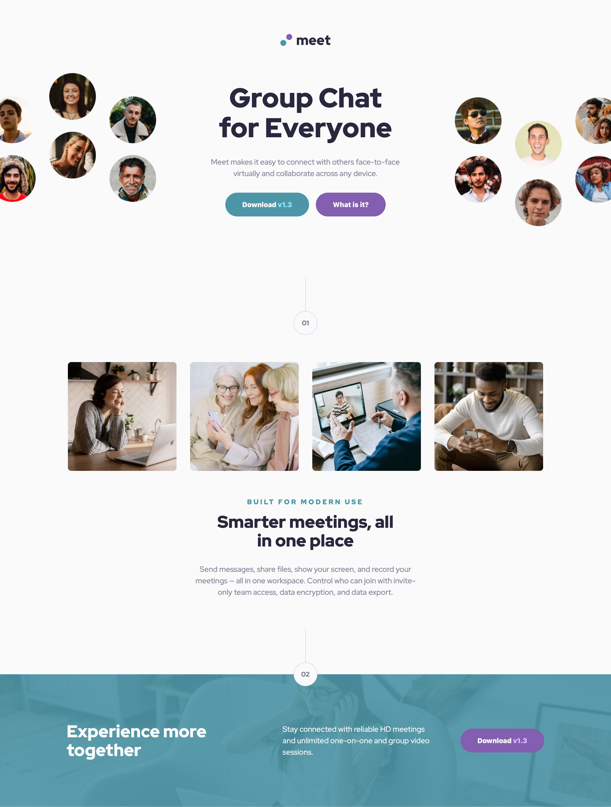
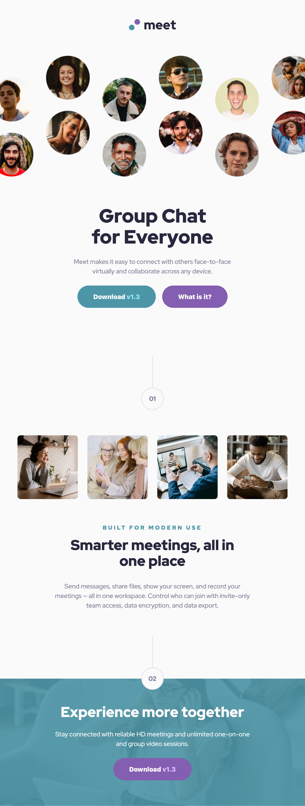
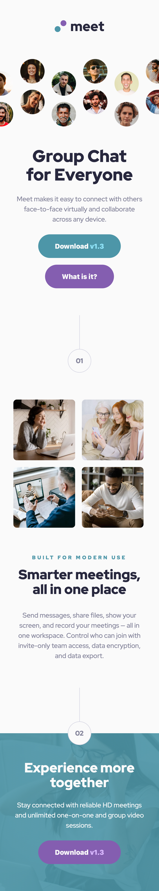
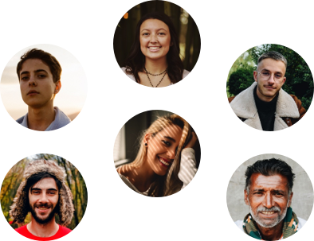

# Frontend Mentor - Meet landing page solution

This is a solution to the [Meet landing page challenge on Frontend Mentor](https://www.frontendmentor.io/challenges/meet-landing-page-rbTDS6OUR). Frontend Mentor challenges help you improve your coding skills by building realistic projects.

## Table of contents

- [Overview](#overview)
  - [The challenge](#the-challenge)
  - [Screenshot](#screenshot)
  - [Links](#links)
- [My process](#my-process)
  - [Built with](#built-with)
  - [What I learned](#what-i-learned)
  - [Continued development](#continued-development)
  - [Useful resources](#useful-resources)
  - [AI Collaboration](#ai-collaboration)
- [Author](#author)
- [Acknowledgments](#acknowledgments)

## Overview

### The challenge

Users should be able to:

- View the optimal layout depending on their device's screen size
- See hover states for interactive elements

### Screenshot





### Links

- Solution URL: [github.com/QusBee/meet-landing](https://github.com/QusBee/meet-landing)
- Live Site URL: [qusbee.github.io/meet-landing](https://qusbee.github.io/meet-landing/)

## My process

### Built with

- Semantic HTML5 markup
- CSS custom properties
- Flexbox
- CSS Grid
- Mobile-first workflow

### What I learned

This was my first time building a fully responsive, multi-breakpoint layout by hand, and a few things really clicked during the process.

**Art-directed images with `<picture>`.** The hero section needed a different image per breakpoint, not just a resized one. `<picture>` can only contain a single `` as its fallback, so each independently-swapped image needs its own `<picture>` wrapper:

```html
<picture class="hero__picture">
  <source media="(min-width: 768px) and (max-width: 1439px)" srcset="assets/tablet/image-hero.png">
  
</picture>
```

**Flexbox's default `align-items: stretch` can silently distort things.** A `<button>` placed inside a flex column without an explicit `align-items` stretches to the full width of its container instead of keeping its natural "pill" size. The fix was adding `align-items: center` to the flex parent.

**Positioning bleeding images with CSS Grid.** The hero and footer images in the desktop design deliberately overflow past the edge of the viewport. I used `justify-self`/`align-self` on the grid items, combined with exact offsets measured in Figma, to anchor each image to one edge of its grid cell so the extra width spills outward instead of overlapping the content next to it.

**`display: contents`.** `grid-area` only works on *direct* children of a grid container. Since my hero images were wrapped in an extra `<div>`, I used `display: contents` on that wrapper to remove it from the box tree without changing the HTML structure.

**Debugging real overflow vs. rendering artifacts.** I learned to tell apart genuine bugs from browser quirks (a 1px scrollbar reducing `clientWidth`, or sub-pixel rounding from fractional `line-height` values) by comparing `document.documentElement.clientWidth` against `scrollWidth`, and by checking computed box models in DevTools instead of guessing.

**BEM modifiers for shared components across breakpoints.** Reusing one `.content` block for two different sections (with different gaps, alignment and widths at different breakpoints) worked much better once I introduced small modifiers (`.content--gap-sm`, `.title--bottom`) instead of writing one-off overrides scattered across the file.

### Continued development

- Get more comfortable with `clamp()` for fluid typography and spacing, instead of only fixed breakpoint values.
- Practice planning a BEM structure *before* writing CSS, rather than refactoring it midway through a breakpoint.
- Spend more time on accessibility — focus states, keyboard navigation, and testing with a screen reader.

### Useful resources

- [MDN - The Picture element](https://developer.mozilla.org/en-US/docs/Web/HTML/Element/picture) - Clarified exactly how `<source>` and `` work together inside `<picture>`.
- [MDN - CSS Grid alignment](https://developer.mozilla.org/en-US/docs/Web/CSS/CSS_grid_layout/Box_alignment_in_grid_layout) - Helped me understand `justify-self`/`align-self` on individual grid items, which I needed for the bleeding hero images.

### AI Collaboration

I used Claude (Claude Code) as a mentor throughout this project, not as a code generator.

- **How I used it:** I wrote all the HTML and CSS myself. Claude reviewed my code pedantically after each milestone (pointing out BEM inconsistencies, redundant properties, real bugs), answered "why is this happening" questions when something rendered unexpectedly, and walked me through new concepts (CSS Grid alignment, `display: contents`, `<picture>`) with hints and guiding questions rather than ready-made code.
- **What worked well:** Being pushed to measure things myself in Figma and DevTools (exact pixel offsets, computed widths, `scrollWidth` vs `clientWidth`) instead of being handed an answer meant I actually understood *why* a fix worked, not just that it worked.
- **What I'd do differently:** A few times I jumped straight to asking "how do I fix this" before fully diagnosing the cause myself — slowing down to form my own hypothesis first usually got me to a better, more lasting understanding.

## Author

- Frontend Mentor - [@QusBee](https://www.frontendmentor.io/profile/Qusbee)
- GitHub - [@QusBee](https://github.com/Qusbee)

## Acknowledgments

Thanks to the Frontend Mentor team for the design files and challenge brief.
