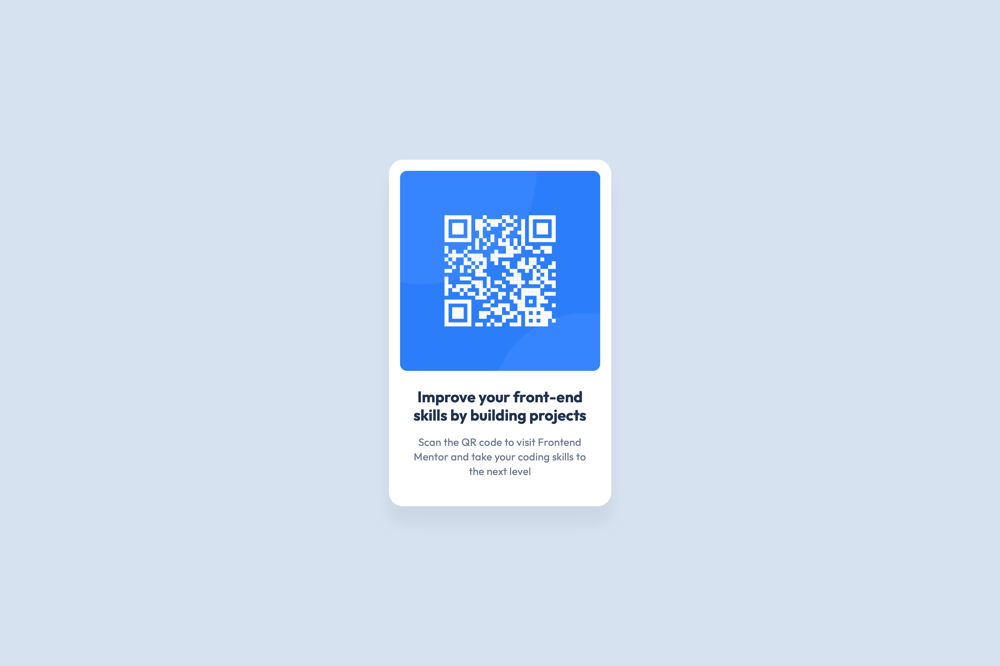
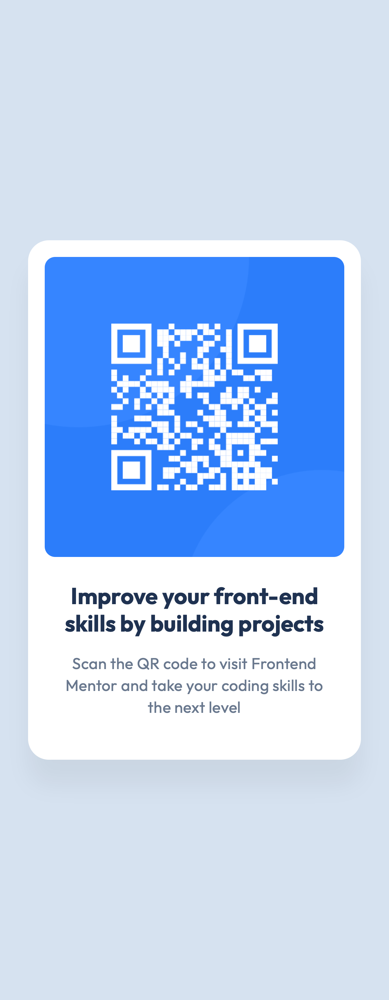

# Frontend Mentor - QR code component solution

This is a solution to the [QR code component challenge on Frontend Mentor](https://www.frontendmentor.io/challenges/qr-code-component-iux_sIO_H). Frontend Mentor challenges help you improve your coding skills by building realistic projects.

## Table of contents

- [Overview](#overview)
  - [The challenge](#the-challenge)
  - [Screenshot](#screenshot)
  - [Links](#links)
- [My process](#my-process)
  - [Built with](#built-with)
  - [What I learned](#what-i-learned)
  - [Continued development](#continued-development)
  - [Useful resources](#useful-resources)
  - [AI Collaboration](#ai-collaboration)
- [Author](#author)
- [Acknowledgments](#acknowledgments)

## Overview

### The challenge

Build out the QR code component and get it looking as close to the design as possible. The card should stay centered on the page and remain usable on screens down to 320px wide.

### Screenshot




### Links

- Solution URL: [QR code component source](https://github.com/QusBee/practice/tree/main/frontend-mentor/qr-code)
- Live Site URL: [QR code component](https://qusbee.github.io/practice/frontend-mentor/qr-code/)

## My process

### Built with

- Semantic HTML5 markup
- CSS custom properties
- Flexbox
- BEM class naming
- Mobile-first workflow

### What I learned

This was a small project, but it was a good way to practice the basics carefully and to turn a Figma design into CSS.

**Translating Figma sizing into CSS.** In Figma the image had a fixed size and the text block was set to "fill". In CSS this became a card with a `max-width` and `width: 100%`, an image that is fluid up to its design size, and a text block that fills the card on its own because it is a block-level element. If the card were sized by its content, the long paragraph could stretch it wider than the image.

**Keeping image proportions.** A fixed `height` combined with a fluid `width` squeezes a square image on narrow screens. Using `height: auto` (the `width` and `height` attributes in the HTML give the browser the aspect ratio) keeps it square:

```css
.card__image {
  max-width: 28.8rem;
  width: 100%;
  height: auto;
}
```

**Meaningful `alt` text.** An empty `alt` is for decorative images. A QR code is content, so the `alt` describes what it is and where it leads, written as one natural phrase instead of a list of words.

**`rem` vs `em`.** With `html { font-size: 62.5% }`, `1rem` equals 10px, which makes the math easy. Properties tied to typography, like `letter-spacing`, are better in `em` so they scale with the font size (0.2px at 15px is about `0.013em`).

**Other small things.** `box-sizing: border-box` so padding does not add to the set width, an outer `margin` on the card so it never touches the screen edges, and picking one consistent order of properties across all rules.

### Continued development

- Try `clamp()` for fluid sizes instead of a single fixed value.
- Plan the BEM structure before writing the CSS.
- Practice measuring values in Figma (spacing, shadows, typography) and checking the result in DevTools at several widths.
- Spend more time on accessibility, including testing with a screen reader.

### Useful resources

- [MDN - box-sizing](https://developer.mozilla.org/en-US/docs/Web/CSS/box-sizing) - Explains why padding and borders can change the final width of an element.
- [MDN - alt attribute](https://developer.mozilla.org/en-US/docs/Web/HTML/Element/img#alt) - Guidance on writing useful alternative text.
- [Google Fonts - Outfit](https://fonts.google.com/specimen/Outfit) - The font used in the design, with variable and static weights.

### AI Collaboration

I used Claude as a mentor and reviewer, not as a code generator.

- **How I used it:** I wrote all the HTML and CSS myself. Claude reviewed the code after each stage, pointing out mistakes (a broken `<link>` attribute, an empty `box-shadow` value, a fixed image height that distorts it on narrow screens) and small details like consistency of paths and property order. It explained concepts with hints and options instead of ready-made code.
- **What worked well:** Having to decide between options myself (variable font vs. fixed weights, `rem` vs. `em`, fixed vs. fluid image) made it clear why I chose each one.
- **What I'd do differently:** Check my own work in DevTools at several screen widths before asking for a review, so I find more problems myself.

## Author

- Frontend Mentor - [@QusBee](https://www.frontendmentor.io/profile/Qusbee)
- GitHub - [@QusBee](https://github.com/Qusbee)

## Acknowledgments

Thanks to the Frontend Mentor team for the design files and challenge brief.
